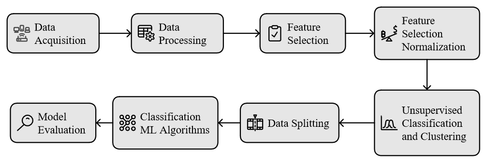

# PyMLDA - Machine Learning for Damage Assessment: applied to failure classification in the Aventa wind turbine during operation

## About
The PyMLDA is an open-source Python code that provides a comprehensive and effective approach to monitoring the structural integrity of systems and structures using signatures based on dynamics and vibration. By integrating experimental data and machine learning algorithms, the PyMLDA offers an effective tool for assessing structural integrity through structures' dynamic response. The approach combines supervised and unsupervised machine learning (ML) algorithms to address the challenges of assessing faults in structures and systems.
The input dataset assumes dynamic response (natural frequency, frequency response function (FRF), time or frequency spectrum) obtained from numerical or experimental tests to calculate a damage index  or damage metrics under healthy and damaged conditions, serving as input for the algorithms. The framework employs a variety of validation and cross-validation metrics to assess the effectiveness and accuracy of these machine-learning algorithms in detecting and diagnosing structure-related issues. The PyMLDA open-code includes graphical features visualisingzing the results of the classification model.
Initially, the algorithm aims to automatically extract patterns and features from the data by reading through damage indices. Subsequently, the algorithm is employed to identify the damage state using classification techniques (damaged or healthy) and regression (e.g., damage size, variability associated with estimation, etc.).
From the processed data, if necessary for the user, it is possible to determine actions to correct the structure or components and implement appropriate measures. Hence, PyMLDA software applies to monitoring structures through their dynamic response, using machine learning algorithms to identify and quantify damage.

## Application of the PyMLDA in the failure classification in the Aventa wind turbine during operation
The Aventa proposed monitoring model is based on the open-code PyMLDA.  The novelty introduced in the PyMLDA for this application is the improved feature extraction from temporal signals, including a new damage index relative change feature, which enhances the no-supervised K-means failure classification accuracy. This combination of unsupervised methods significantly improves diagnostic capabilities, enhancing the efficiency and accuracy of operation condition monitoring. Testing PyMLDA on the real Aventa dataset provided an opportunity to refine the code and validate it on a complex system. 

## PyMLDA workflow applied to monitor the Aventa wind turbine

The Aventa monitoring application consists of eight steps, comprising receiving the acquired data (step 1), data processing (step 2), feature selection (step 3), and pattern recognition and clustering (step 4). Subsequently, data splitting is performed in step 5. Classification ML algorithms (steps 6 and 7) used for damage condition assessment, pattern recognition and classification. Finally (step 8), the algorithm furnishes information regarding the damage state based on the classification algorithm outcomes for evaluation based on the metrics and confusion matrix. The novelty proposed in this study and improved in version 1 of PyMLDA are the features extraction based on temporal signal and the new relative change damage index.   The workflow of the steps is illustrated in the following figure. 
<p align="center">
  
</p>

The algorithm's steps are detailed in the following:
1. **Data acquisition:** The initial stage involves collecting data from the monitored structure, the wind turbine Aventa AG.
2. **Data pre-processing:** This data-driven approach requires understanding and examining inherent data features before integrating them into the machine learning model for accurate classification and estimation. This step includes analysing the structure's spectrum response, where specific sensor outcomes are verified and selected.  
3. **[*]Feature selection:**  Feature selection involves choosing a subset of variables from the original dataset. This step transforms the spectrum data into new variables to create a refined dataset. Maximum, minimum, amplitude range, median, mean, variance, energy, energy centre, skewness, kurtosis, moment order, Shannon entropy, signal rate, and RMS are the new features extractor implemented inthe PyMLDA. 
4. **[*]Feature sensitivity and normalisation:** Some features are more sensitive to events than others. Thus, this step evaluates each feature and selects the best capture changes observed in step 3. It is a supervised process. Since feature extractors vary in characteristics and amplitude, a normalisation feature extractor is proposed using the damage index relative change (RC_f) approach,  which also normalise and scale the features.
5. **Unsupervised classification and clustering:** The normalised features from step 4 are input into an unsupervised classification and clustering process, performed using the k-means algorithm. The elbow method is applied to determine the optimal number of clusters. For validation, the elbow method was confirmed using K=2 for binary classification and K=4 for multi-classification. The k-means algorithm clusters the normalised dataset based on sensitive features, resulting in a clustered dataset. The outputs are subsequently used as inputs for six supervised classification algorithms for further analysis. All ML algorithms are based on the open-source Scikit-learn library.
6. **Data splitting:**  The clustered dataset is divided into 25% for testing and 75% for training and validation, employed for model construction and evaluation. 
7. **Metric evaluation:** Six supervised classification algorithms are applied to the training data using the Scikit-learn library, allowing the model to learn patterns and relationships in the dataset pre-classified by K-means. Evaluation metrics are generated based on these classifications.
8. **Model Evaluation:** This final step tests the model's performance on the previously separated test dataset (as per steps 7 and 8). Hyperparameters can be fine-tuned to improve metrics such as Accuracy, Precision, Recall, and F1-Score. The confusion matrix is also analysed for additional insights. A 5-fold cross-validation is employed to prevent overfitting and enhance model generalisation.

The subscript [*] represents a novelty proposed and incorporated in the version 1 of PyMLDA.

## Machine Learning Algorithms  
* Decision tree (DT)
* Random forest (RF)
* K-NN
* SVM
* Naive Bayes
* XGBoost  
* K-means
* SVR

## Requirements & Libraries  
* Python 3.7+ 
* [scikit-learn](https://scikit-learn.org/stable/)  
* [Xgboost](https://xgboost.readthedocs.io/en/latest/python/python_intro.html)
* [scikit-optimize](https://github.com/scikit-optimize/scikit-optimize)  

The PyMLDA software uses additional packages required for the algorithm's operation. Therefore, before the code execution, make sure you have the following packages installed.Here is a brief tutorial on creating a virtual environment, in case you wish, without affecting other projects on your machine. Please see below:
1. Open the command prompt and run one at a time, following steps 2 to 11.
2. conda create -n Teste_ML
3. conda activate Teste_ML
4. pip install numpy
5. pip install matplotlib
6. pip install pandas
7. pip install seaborn
8. pip install imbalanced-learn
9. pip install -U scikit-learn
10. pip install xgboost
11. Run the PyMLDA (code).

### 🚀 Launch the PyMLDA

You can start the project by running the `PyMLDA_Machine_Learning_for_Damage_Assessment.ipynb` or `pymlda_machine_learning_for_damage_assessment.py` file in the root directory. With this, the application settings are loaded from the DI dataset `DI_FRAC_Exp-estimation.xlxs`, which is also available in the repository. The system starts processing the DI dataset using the selected model and provides some evaluations on it. The final output is a classification of the system's healthy condition as damaged or healthy and the damage quantification with a variability associated with the estimation.


## 🧩 Contribution Guide

Contributing to open-source codes is a rewarding method to learn, teach, and gain experience. We welcome all contributions, from bug fixes to new features and extensions. Do you want to be a contributor to the project? Read more about it on our page (https://sites.google.com/view/marcelamachado/publications/open-source).


## 🟢 Versions
- Version 1
  - Implementation of the PyMLDA in Python language.
  - Supporting as input only the damage index already processed.
- Version 2
  - Implementation of new features extractor based on time series and a new relative change damage index was included.
  - Supporting as input only the damage index already processed. 

<!--
## 🟠 Next realease

- Incorporation of Damage Index calculation and selection of the better DI
- Raw data will be given as input (Natural Frequency, temporal and frequency response of the dynamic system)
-->

##  References

[1] Amanda A.S.R. de Sousa, Marcela R. Machado, Experimental vibration dataset collected of a beam reinforced with masses under different health conditions, Data in Brief, 2024, 110043,ISSN 2352-3409,
https://doi.org/10.1016/j.dib.2024.110043.

[2] A. A. S. R. D. Sousa, and M. R. Machado. “Damage Assessment of a Physical Beam Reinforced with Masses - Dataset”. Multiclass Supervised Machine Learning Algorithms Applied to Damage and Assessment Using Beam Dynamic Response. Zenodo, November 8, 2023. https://doi.org/10.5281/zenodo.8081690.

[3] Coelho, J.S., Machado, M.R., Dutkiewicz, M. et al. Data-driven machine learning for pattern recognition and detection of loosening torque in bolted joints. J Braz. Soc. Mech. Sci. Eng. 46, 75 (2024). https://doi.org/10.1007/s40430-023-04628-6

[4] Coelho, J.S., Machado, M.R., Souza, A.A.S.R.D., PyMLDA: A Python open-source code for Machine Learning Damage Assessment. Software Impacts, 19, 100628 (2024). https://doi.org/10.1016/j.simpa.2024.100628 


## 📝 Citation

If you find **PyMLDA** useful for your research or development, please cite the  following:

```
@article{PyMLDAsoft24,
author = {Coelho, J.S., and Machado, M.R., and Souza, A.A.S.R.D.},
title = {PyMLDA: A Python open-source code for Machine Learning Damage Assessment},
journal = {Software Impacts},
volume = {19},
pages = {100628},
year = {2024},
doi = {10.1016/j.simpa.2024.100628}, }
```

